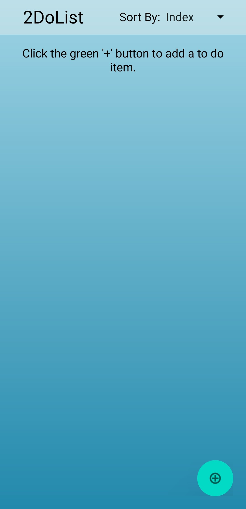

# Hi there, I'm Brad! 👋

## About Me 🚀

I'm a passionate **Software Engineer** with experience in **Java, Web, and Android Development**. I love tackling complex problems, learning new skills, and collaborating with diverse teams to create innovative solutions.

- 🌱 Currently learning: **Angular, UI Testing, Open Source**
- 🔭 Working on: **2DoList - Task Automation, TrackOrderFlow - Ordering System**
- 🌍 Languages: **Java, JavaScript, TypeScript, Python, C, SQL, Kotlin**

## My Skills 🧠

## Featured Projects 💻

### [2DoList](https://github.com/bradburzon/2DoList)

**2DoList** is an Android app built with **Java, XML, Gradle, Material UI, Git, TDD, and Unit Testing**. This project highlights my proficiency in developing reliable and maintainable software, specifically tailored for task automation. Here are some key accomplishments and methodologies applied in this project:

- **Code Maintainability**: Enhanced by 30%, which significantly simplified future updates and scalability. This improvement was achieved through rigorous adherence to best coding practices such as DRY (Don't Repeat Yourself), functional state commits, KISS (Keep It Simple, Stupid), and SOLID principles.

- **Project Completion Speed**: Accelerated by 15%, enabling faster releases. This increase in efficiency was facilitated by optimizing the development workflow, utilizing version control with GitHub, and refining processes in Android Studio and IntelliJ.

- **User Engagement and Satisfaction**: Developed features that automate task handling, thereby increasing user engagement and satisfaction.

## Get in Touch 📬

- **[Personal Website / Blog](https://bradburzon.com/)**
- **[LinkedIn](http://www.linkedin.com/in/brad-burzon)**

