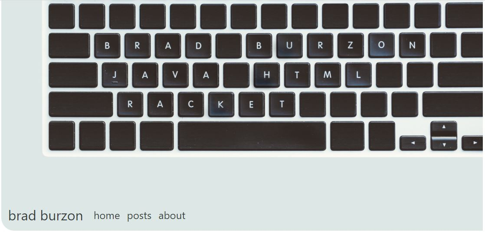

# Blogging with Jekyll with Bootstrap

This repository is for my [website](https://bradburzon.com). I am using [Jekyll](https://jekyllrb.com/), a static site generator, and used HTML, CSS, and Bootstrap for design.

## Getting Started

These instructions will get you a copy of the project up and running on your local machine for development purposes. See deployment for notes on how to deploy the project on a live system.

### Prerequisites

#### Ruby and Jekyll
Follow [this](https://jekyllrb.com/docs/installation/windows/)
1) Install Ruby(for [Windows](https://rubyinstaller.org/))
 * then run this to check the version if properly installed
   ```
   ruby -v
   ```
2) Install Jekyll
 * after ruby install, run
   ```
   gem install jekyll bundler
   ```

## Deployment

After installing Jekyll, the site can now be hosted through your local machine.

Clone this repository. Open git and navigate to this repository. Then run
```
bundle exec jekyll serve
```

## Built With

* [Jekyll](http://https://jekyllrb.com/) - Static Site Generator
* [Bootstrap](https://maven.apache.org/) - CSS Framework used
